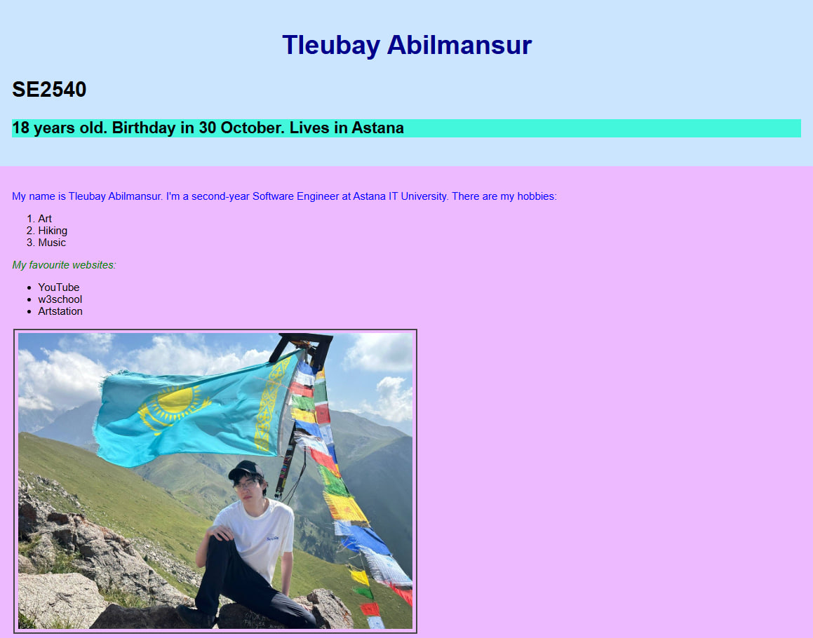
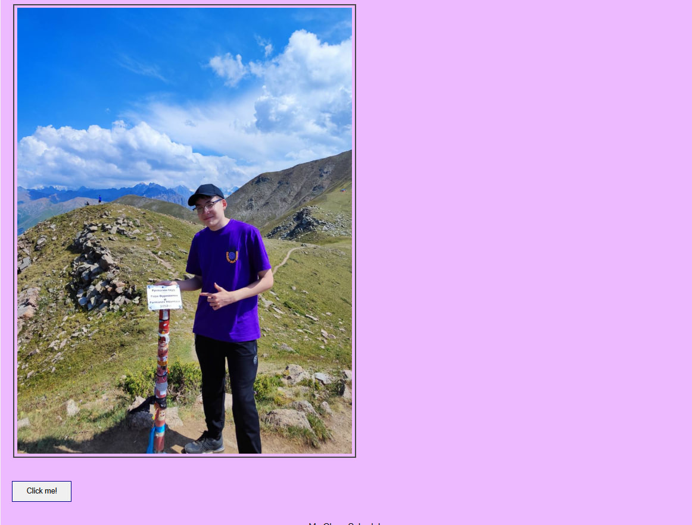
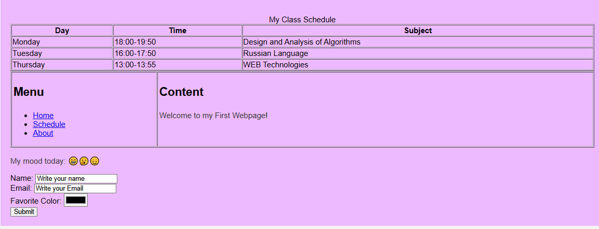
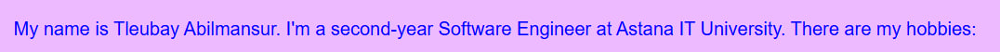
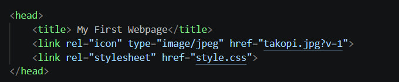
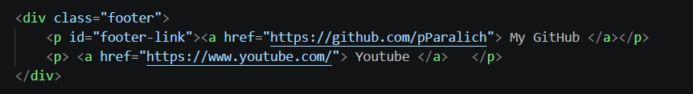
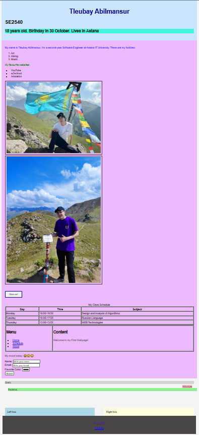
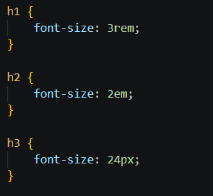

# My First Webpage — HTML & CSS Basics

### **Student:** Tleubay Abilmansur Group: SE2540

---

## **Objective**
The goal of this assignment is to create your own website, starting from the basic page structure and moving on to CSS styling, layout, and publishing it online.

---

## Part 1-2: Html Structure

Built the page structure: headings, an about-me paragraph, ordered/unordered lists (hobbies and favorite sites), two images, links, a button, a class schedule table, a two-column table layout (menu/content), emojis, and a contact form (name, email, color, submit).

---

## Part 3: Introduction to CSS

### Styled the page using all three CSS methods:

- Inline CSS — colored one paragraph directly with style="color:blue;"
- Internal → External CSS — moved all styles into a separate style.css file, linked via <link rel="stylesheet">
- Selectors — used element (p), class (.note, .highlight), and ID (#main-heading, #footer-link) selectors to style different parts of the page

---

## Part 4: Intermediate CSS

### Added more advanced layout and styling:

- Custom favicon
- Page split into divs: header, main content, footer
- Box model: borders, margins, and padding on images/button
- Positioning: static, relative, and absolute elements
- Sizing units: px, %, em, rem
- Float/clear: two floated boxes with a clearfix

---

## **Website**:

https://pparalich.github.io/front-assignment1/

---

## **Final Reflection**

This assignment helped me understand how HTML and CSS interact: HTML handles the structure, while CSS manages the visual appearance. The most challenging aspects were grasping the box model and the differences between relative and absolute positioning, as well as debugging a browser caching issue with the favicon. Overall, it provided me with a solid foundation for creating and styling web pages.